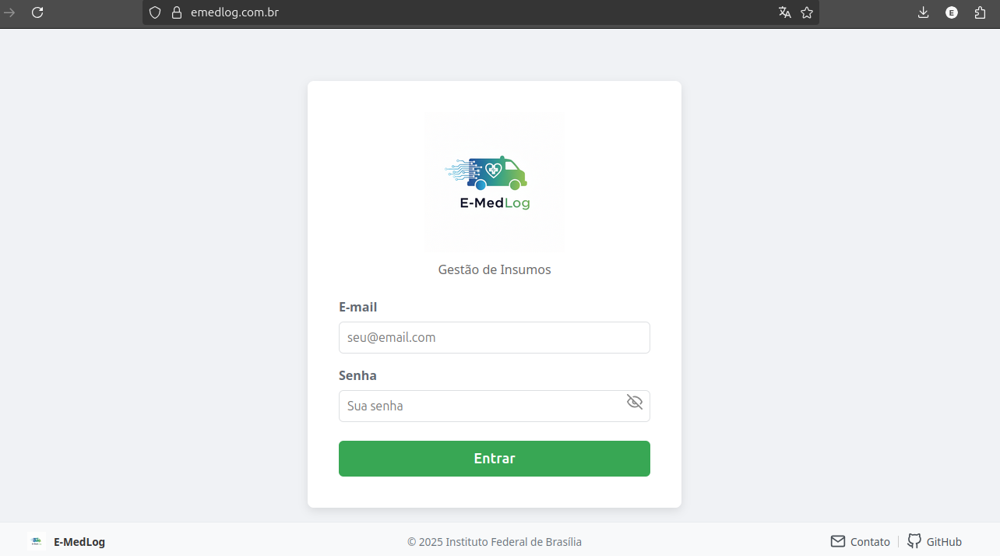
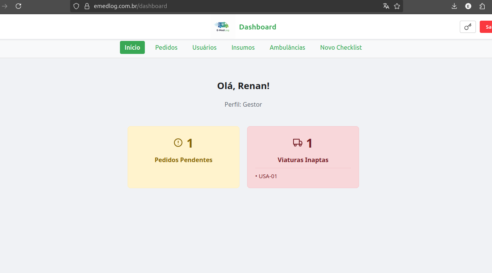
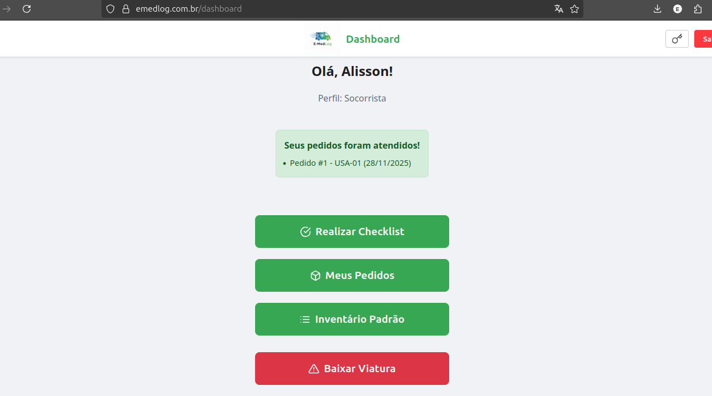

# E-MedLog: Gestão de Insumos para Ambulâncias

> Agilidade na Linha de Frente da Saúde: Sistema Web (PWA) para Gerenciamento de Insumos em Ambulâncias de UPAs.


##  Acesso ao Sistema

O sistema está implantado e acessível através do seguinte endereço:

**[https://emedlog.com.br](https://emedlog.com.br)**


## Sobre o Projeto

O **E-MedLog** é um sistema desenvolvido para modernizar e otimizar o fluxo de reposição de materiais médicos em viaturas de emergência.

O projeto substitui o antigo método manual (baseado em formulários de papel) por uma solução digital eficiente que garante rastreabilidade e segurança. O sistema funciona como um **Progressive Web App (PWA)**, permitindo que socorristas realizem checklists e pedidos diretamente de dispositivos móveis, mesmo em trânsito.

Desenvolvido a partir da observação direta da rotina de urgência médica, este sistema elimina a dependência de papéis e evita a falta de materiais críticos nas viaturas, otimizando o tempo dos socorristas e farmacêuticos.


## Tecnologias Utilizadas

O projeto foi construído utilizando uma arquitetura moderna e modular:

### Front-end (Interface)
* **React**: Biblioteca principal para construção da interface.
* **Vite**: Ferramenta de build rápida e otimizada.
* **React Router DOM**: Gerenciamento de rotas e navegação.
* **CSS Modules / Variáveis CSS**: Estilização responsiva e padronizada (Mobile First).

### Back-end (API)
* **Python**: Linguagem principal.
* **Flask**: Microframework para criação da API RESTful.
* **Flask-Bcrypt**: Para criptografia segura de senhas.
* **Flask-Cors**: Para gerenciamento de segurança cross-origin.

### Banco de Dados
* **MariaDB**: Banco de dados relacional para persistência segura das informações.

### Infraestrutura e Deploy
* **Raspberry Pi 2 Model B**: Servidor de hospedagem.
* **Nginx**: Servidor web e Proxy Reverso.
* **Gunicorn**: Servidor WSGI para executar a aplicação Python em produção.
* **Cloudflare Tunnel**: Para acesso remoto seguro via HTTPS.


## Funcionalidades Principais

### Perfil Socorrista
* **Checklist Inteligente:** Lista padronizada de insumos com indicação de quantidade mínima.
* **Preenchimento Quantitativo:** Informa a quantidade real encontrada na viatura.
* **Pedido Automático:** O sistema calcula a diferença e gera o pedido de reposição automaticamente apenas para os itens em falta.
* **Histórico:** Visualização dos pedidos anteriores e seus status.

### Perfil Farmácia
* **Gestão de Pedidos:** Visualização em tempo real de pedidos pendentes.
* **Atendimento:** Detalhamento dos itens solicitados e marcação de pedidos como "Atendidos".

### Perfil Gestor
* **Dashboard Administrativo:** Visão geral do sistema.
* **Gestão de Usuários (CRUD):** Cadastro, edição e inativação de socorristas e farmacêuticos.
* **Gestão de Insumos (CRUD):** Controle total sobre o catálogo de materiais e estoques mínimos.
* **Controle de Ambulâncias:** Monitoramento do status das viaturas (Apta/Inapta).


## Screenshots


| Login | Dashboard | Checklist |
|:---:|:---:|:---:|
|  |  |  |


## Como Executar Localmente

Para rodar o projeto na sua máquina para desenvolvimento:

### Pré-requisitos
* Node.js e npm instalados.
* Python 3.x instalado.
* MySQL ou MariaDB rodando localmente.

### 1. Configuração do Back-end

```bash
# Clone o repositório
git clone [https://github.com/Erenan257/tcc.git](https://github.com/Erenan257/tcc.git)
cd tcc/backend

# Crie e ative o ambiente virtual
python -m venv venv
source venv/bin/activate  # (Ou .\venv\Scripts\activate no Windows)

# Instale as dependências
pip install -r requirements.txt

# Configure o banco de dados
# (Certifique-se de criar um banco 'emlog_db' no seu MySQL local antes)
mysql -u root -p < schema.sql

# Execute o script de seed (opcional, para criar usuários iniciais)
python seed.py

# Inicie o servidor
python run.py

# Em um novo terminal, vá para a pasta do frontend
cd ../frontend

# Crie o arquivo .env com o IP do seu backend
echo "VITE_API_URL=http://localhost:5000" > .env

# Instale as dependências
npm install

# Inicie o servidor de desenvolvimento
npm run dev

Autor

    Renan Eduardo da Silva Souza - Desenvolvimento e Documentação
